# Resume Master - AI Resume Optimizer

An intelligent resume optimization system that helps software engineers create tailored, impactful resumes for each job application using AI-powered analysis and feedback.

## What It Does

Resume Master helps candidates create stronger resumes by:

- **Tailoring resumes to specific jobs** - AI automatically matches your best bullet points to job descriptions
- **Providing honest feedback** - Get detailed, actionable feedback on your resume with specific improvement suggestions
- **Interview preparation** - Generate personalized interview questions based on your resume experiences
- **One-page optimization** - Automatically selects and formats content to fit a professional one-page template
- **Real-time collaboration** - Get feedback from experienced reviewers through live collaboration tools

## Key Features

### 🤖 AI-Powered Resume Tailoring
- Paste or extract a job description, and Resume Master automatically selects and optimizes your most relevant bullet points
- Uses advanced AI to match your experience to job requirements (semantic understanding + keyword matching)
- Suggests improvements to make your bullets more impactful and ATS-friendly

### 📝 AI Coach

**Roast My Bullets**
- Get brutally honest feedback on your resume with:
  - Overall score and summary of strengths/weaknesses
  - Bullet-by-bullet analysis with color-coded feedback
  - Specific improvement suggestions with example rewrites
  - Identifies missing quantifiable results, weak verbs, and vague language

**Interview Question Prep**
- Select any experience or project from your resume
- Generate personalized behavioral and technical interview questions
- Get STAR-method frameworks to help structure your answers

### 👥 Human Feedback
- Connect with experienced reviewers through a queue-based matching system
- Real-time collaboration with live chat, highlighting, and contextual comments
- Get personalized feedback from industry professionals

### 📄 Professional Formatting
- LaTeX-based template ensures clean, professional formatting
- Automatic one-page optimization that adapts to your content
- PDF preview and sharing capabilities

### 💾 Master Resume System
- Build one comprehensive "master resume" with all your experiences and projects
- Generate multiple tailored versions for different job applications
- Keep everything organized in one place

## How It Works

1. **Build Your Master Resume** - Add all your experiences, projects, and achievements with unlimited bullet points
2. **Tailor for Each Job** - Paste a job description and let AI select and optimize your best bullets
3. **Get Feedback** - Use AI Coach or connect with human reviewers to improve your resume
4. **Export & Share** - Generate professional PDFs and share links for feedback

## For Recruiters & Hiring Managers

Resume Master helps candidates submit stronger applications by:

- **Better job matching** - Candidates submit resumes that are actually relevant to the role
- **Clearer communication** - Bullet points are optimized for clarity and impact
- **Professional formatting** - Consistent, clean resume format across all applications
- **More qualified candidates** - Candidates who use feedback tools tend to have more polished applications

## Quick Start

### Prerequisites
- Python 3.11+
- Node.js 18+
- OpenAI API Key
- Supabase Account (for resume storage)

### Setup

**Backend:**
```bash
cd backend
pip install -r requirements.txt
cp env.example .env  # Add your API keys
uvicorn app.main:app --reload
```

**Chrome Extension:**
```bash
cd chrome-extension/popup
npm install
npm run build
# Load the chrome-extension directory in Chrome via chrome://extensions/
```

Visit `http://localhost:8000/docs` for API documentation.

## Architecture



## Tech Stack

**Backend:** FastAPI, OpenAI API, Supabase, ChromaDB (vector search)  
**Frontend:** React, Chrome Extensions API, PDF.js  
**AI:** GPT-4, text-embedding-3 (OpenAI), Hybrid search (semantic + keyword matching)

## Project Structure

```
ResumeMaster/
├── backend/           # FastAPI backend with AI services
├── chrome-extension/  # Chrome extension UI (React)
└── README.md
```

## Documentation

- **[WebSocket Collaboration](./WEBSOCKET_COLLABORATION.md)** - Real-time collaboration implementation details

## License

MIT License

---

**Built to help software engineers create resumes that get noticed.**
